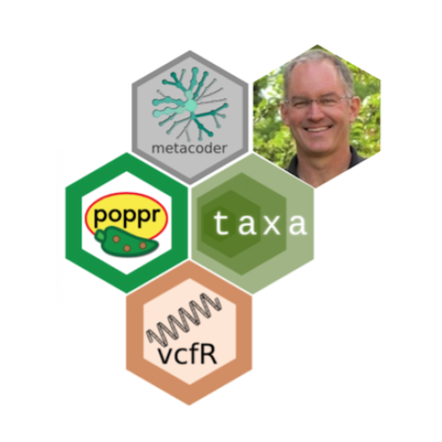
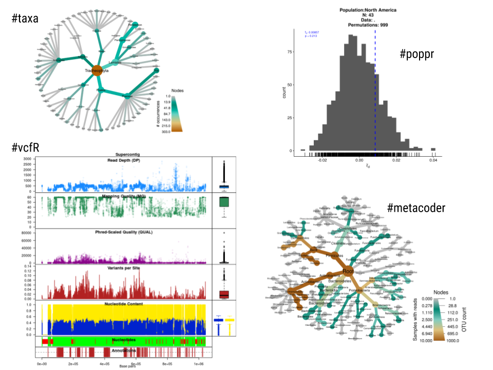
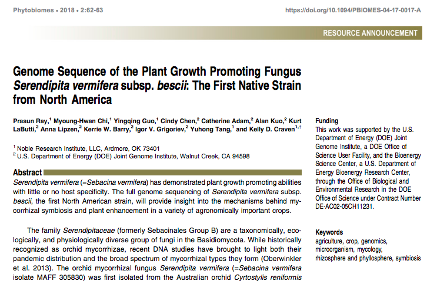

Our first OPP interview features Dr. Niklaus Grünwald [@PhytophthoraLab on Twitter](<https://twitter.com/PhytophthoraLab>), a plant pathologist with USDA ARS, Corvallis, OR, USA. Nik is well recognized by his [research](http://grunwaldlab.cgrb.oregonstate.edu/lab-biblio#overlay-context=lab-biblio) on population genetics and genomics of plant pathogens - mainly on oomycetes of major importance to global agriculture. The [Grünwald Lab](http://grunwaldlab.cgrb.oregonstate.edu/) has made significant scientific contributions to the understanding of the population biology and evolution of *Phytophthora infestans* worldwide.



More recently, his students have developed R packages which have contributed considerably to advance and facilitate the analysis of genetic and genome sequence data with applications in taxonomy and evolution, beyond the field of plant pathology. Members of the Grünwald Lab has offered workshops on reproducible research and the analysis of genomic data during the APS meetings using those packages. It is our great pleasure to have Nik answering six questions that we prepared for him. <br><br>

### Tell us about your background, especially when you realized that programming skills were important and which were the languages/software used at that time and for what purpose?

I have used programming as a tool on and off since my undergraduate days. In fact I used to earn pocket money as a programmer. As an econ undergrad major I learned Pascal as my first language. During my PhD I programmed extensively in SAS. As a postdoc I wanted to calculate genotypic diversity indices and could not do it in SAS so I programmed some routines in C to enable calculation of rarefaction as well as for speed.

### When and why did you decide to stop using commercial software and embrace open source software for the development of tools to analyse molecular data in the context of population biology of plant pathogens?

About 8 years ago my lab switched from SAS to using [R](https://www.r-project.org/). I am absolutely loving R because of the open source (and free) nature, the ability to produce publication ready graphs, tools for reproducibility, and the fact that many members of the R community contribute [packages](https://cloud.r-project.org/web/packages/available_packages_by_name.html). The fact that R is open is important because you can actually see the raw code and find mistakes and contribute new functions. SAS procedures are closed. We switched once we could do everything in R that I used to do in SAS. I also love R because it is free. When you have several postdocs and graduate students in the lab, subscriptions to software become very expensive. Another reason I love R is that we can create electronic lab notebooks using [R Markdown](https://rmarkdown.rstudio.com/) that allow for better, albeit not perfect, reproducibility.

### Students are mainly driven by scientific publications in top journals as main, mostly only, outcome of their research. Students of the Grünwald Lab are developing new tools that help to process, analyze and visualize genetic/genomic data as part of the dissertation. This is quite unconventional, in the field of plant pathology at least. Is there a reason for this change? What are the benefits and challenges, for both student and advisor, from investing in the development of tools and not keeping up only with the more conventional hypothesis-driven graduate research?

My way of approaching this is that graduate students should be trained in hypothesis-driven biological research. Interviewing for a faculty position or promotion and tenure rely on the perceived impact of their fundamental biological research. However, while conducting this research we often find ourselves developing custom scripts in ecology, genetics or genomics. If these scripts can be used by other colleagues we release these as a package in R (Fig. 1). We have done this so far with the R packages [poppr](https://grunwaldlab.github.io/poppr/), [vcfR](https://github.com/grunwaldlab/vcfR), [metacodeR](https://grunwaldlab.github.io/metacoder_documentation/), [taxa](https://f1000research.com/articles/7-272/v1), [effectr](https://github.com/grunwaldlab/effectR), and [popprxl](https://github.com/grunwaldlab/popprxl). This sometimes results in an extra publication (eg: [MetacodeR](http://grunwaldlab.cgrb.oregonstate.edu/metacoder-r-package-visualization-and-manipulation-community-taxonomic-diversity-data) and [vcfR](https://onlinelibrary.wiley.com/doi/abs/10.1111/1755-0998.12549)) with a modest amount of additional effort. Methods papers releasing R packages are highly cited; thus, computational biology resources contribute significantly to the citations and the impact of a scientist. But I caution students and postdocs not to rely solely on computational papers since biology papers will remain the bread and butter for recognition and impact of our work.



### You have been quite active on social media advocating for more open and transparent science and data and code sharing. As leader of the publication board of the American Phytopathological Society (APS) journals, a new article type that fits any of the APS journals called [Resource Announcement](https://apsjournals.apsnet.org/page/authorinformation?mobileUi=0#resourceannouncements), have been created. I wonder how you came up with this idea and what are the expectations for this kind of publication.\*

Large data sets, like genome sequences, microbiome or imaging data, are wonderful resources for all of us if they are available with the proper metadata and copyright. The [Resource Announcement](https://apsjournals.apsnet.org/page/authorinformation?mobileUi=0#resourceannouncements) we created for APS journals as a new category provides a venue for getting citations and credit for these types of efforts. We want to incentivize release of data, code and related resources so that it can be reused. Several journals are doing this now including mBio and Molecular Ecology Resources. With the new category of Resource Announcement (Fig. 2), we are keeping plant pathology resources within the ecosystem of APS journals.



### As you know, OPP is for everyone who wants to 1) stay connected with other researchers with interest/developments in the field of plant pathology and 2) contribute to promote open science and reproducible research. It may not fit everyone's needs given the focus of \#OPP on more computational aspects using open source software. What are the areas and target audience that you think shall benefit most from participating and taking leadership in this new community?

I think every plant pathologist benefits from following the \#OPP philosophy of sharing data, code and resources openly and following principles of reproducible research. In the US, the federal government requires open access to publications, data, code and related resources from federally funded grants. Major donors like the Welcome Trust or the Bill and Melinda Gates Foundation similarly require open approaches. \#OPP provides a network and resources for training that benefit all of us in doing open research. I think the fundamental role that \#OPP is playing is to incentivize open, transparent and reproducible research. Not everybody needs to be a hardcore coder, but basic coding including reproducible lab notebooks help reproducibility and benefits all of us. Given organizations like Retraction Watch, PubPeer, and others that monitor reproducibility and rigor in science, it is incumbent upon all of to us to keep good records so that we can correct mistakes in the literature when they are identified. \#OPP facilitates this process and helps all of us learn from each other to become better open scientists.

### For the prospective students who want to join the Grünwald Lab, what is the word of encouragement and necessary skills for those willing to pursue a PhD in the exciting field of population genetics and genomics?

You do not need to be a programmer if you want to work in my lab. However, you should not be afraid of using computational tools to ask biological questions. Today's biology is highly quantitative and I do not see this changing anytime soon. Molecular biology when I went to grad school was not quantitative. In the era of high throughput sequencing the fields of genetics and genomics have adopted highly sophisticated computational and statistical approaches.

### Thanks Nik! Keep up with the good work and thanks for your time

The tweet below highlights members of the Grünwald Lab teaching a workshop during ICPP 2018, Boston, USA.

<blockquote class="twitter-tweet">

<p lang="en" dir="ltr">

.⁦<a href="https://twitter.com/zacharyfoster19?ref_src=twsrc%5Etfw">@zacharyfoster19</a>⁩ ⁦<a href="https://twitter.com/knaus_brian?ref_src=twsrc%5Etfw">@knaus_brian</a>⁩ ⁦<a href="https://twitter.com/ncarleson?ref_src=twsrc%5Etfw">@ncarleson</a>⁩ teaching microbiome analysis workshop at <a href="https://twitter.com/hashtag/icpp2018?src=hash&amp;ref_src=twsrc%5Etfw">\#icpp2018</a> <a href="https://t.co/9pC4IlZoxZ">pic.twitter.com/9pC4IlZoxZ</a>

</p>

--- Niklaus Grunwald (@PhytophthoraLab) <a href="https://twitter.com/PhytophthoraLab/status/1023623571413905410?ref_src=twsrc%5Etfw">July 29, 2018</a>

</blockquote>

```{=html}
<script async src="https://platform.twitter.com/widgets.js" charset="utf-8"></script>
```
