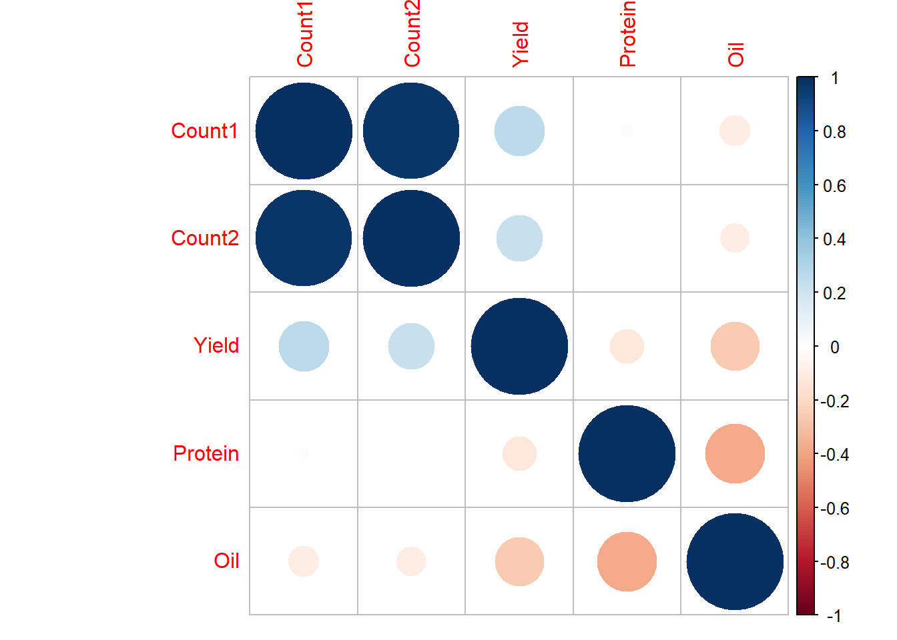

[Website](https://rtools.netlify.app/)

### About

Workshop taught by Esker Lab (Penn State University) at [Plant Health 2019](https://apsnet.confex.com/apsnet/2019/meetingapp.cgi/Session/3078)\
Sat, Aug 3, 2019 - 8:00 AM --- 12:00 PM, Cleveland, Ohio

### Abstract

In this workshop, we will present an overview of different modeling approaches that are available in the R language and environment for statistical and graphical computing. We will focus on using a hands-on approach that explores different aspects of statistical modeling ranging from exploratory data analysis to model development, validation, and prediction. The workshop will integrate different tools that are available in R with specific focus on linear models (lm), nonlinear minimization (nlm), generalized linear models (glm), and dose-response curve fitting with tools from the drc package. We will illustrate concepts using agricultural examples. Some knowledge of R will be helpful but background information will be provided to help guide new users.

