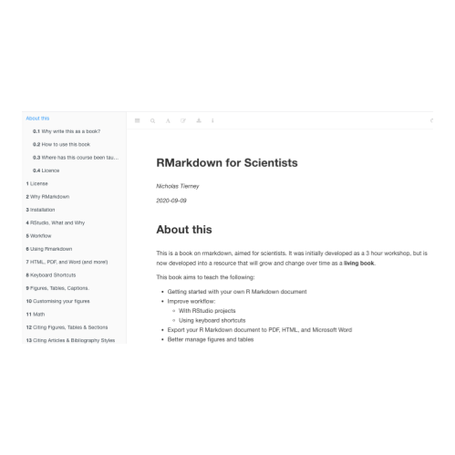

[Website](https://rmd4sci.njtierney.com/) [Code](https://github.com/njtierney/rmd4sci)

### Abstract

As scientists, we often read about or hear about reproducible research, but we may not be sure where to start or how we can make our research reproducible.
Sharing code, scripts and data that make up your analysis with others such that they are able to easily reproduce your results can make it easy to obtain feedback and improve the quality of your work.
There are an overwhelming number of modern approaches, and online platforms, which can be used to make research reproducible.
This workshop will introduce participants to ways that R and related tools, such as [RMarkdown](https://rmarkdown.rstudio.com/), can be used in creating reproducible research outputs.
These outputs could be internal reports that are generated at the click of a button and each time the data are updated; detailed research compendia to supplement your latest research manuscript sharing the code, data and analysis; or even the research manuscript itself!
This workshop will help you improve your workflow in RStudio by using projects and keyboard shortcuts; managing figures and tables, which dynamically update; managing references and in-text citations; creating bibliographies and modifying bibliography styles.
Participants will gain hands-on experience generating Microsoft Word, PDF, Markdown and HTML document outputs and become familiar using RMarkdown for reproducible research.
Basic familiarity with [R](https://www.r-project.org/) and [RStudio](https://www.rstudio.com/) is required.

