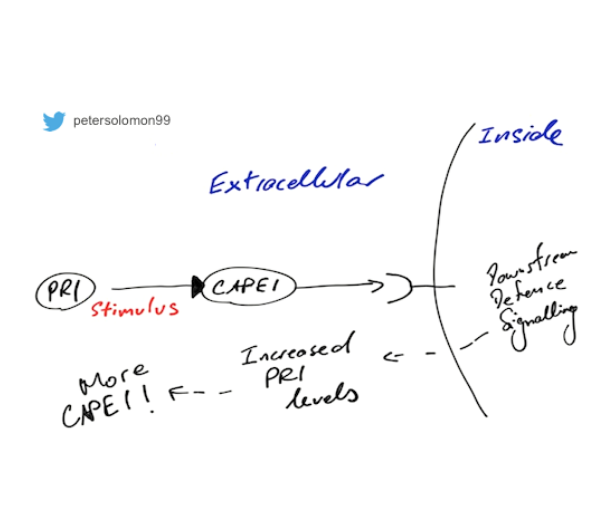

### About

Presenter: Dr. Peter Solomon\
Institution: The Australian National University\
Date: April 20, 2020 \
Host: Dr. Benjamin Schwessinger \
Links: [Video](https://www.youtube.com/watch?v=7Kcrb5Q8CVo) \| [Slides](https://doi.org/0.17605/OSF.IO/DNJSC/)

### Abstract

It had long been thought that necrotrophic plant pathogenic fungi use a barrage of lytic enzymes to break down host cells releasing nutrients for growth.
However, in recent years it has emerged that some necrotrophic fungi facilitate disease through a strict gene-for-gene mechanism as observed in biotrophic pathogens.
For the wheat pathogen *Parastagonospora nodorum* the basis of this host specific interaction is small cysteine-rich effector proteins secreted during infection (ToxA, Tox1 and Tox3).
These effectors interact with specific dominant susceptibility genes in the host leading to a programmed cell death response and disease.
However, whilst we now understand the requirement of these effector proteins for disease, their modes of action remain poorly understood.
In this talk I will present our latest findings on dissecting the dual functionality of the Tox3 effector protein and how this has serendipitously advanced our understanding of the enigmatic host defence protein, PR-1.

