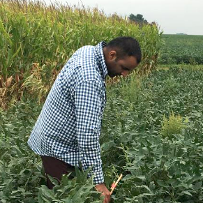

We are happy to kick start a new blog section called **OPP Research Compendia**. We aim to encourage plant pathologists to engage in reproducible research practices by providing examples developed by the plant pathology community. Briefly, the importance of the research and the main steps of the workflow is summarized and links are provided to data, scripts and other research outcomes that help to understand, reproduce and communicate the research findings.

### <i class="fa fa-user"></i> Meet the researcher

In this inaugural post, we showcase a reproducible example of research conducted by Dr. [Muhammad Mohsin Raza](https://mohsinraza.netlify.app/), a recent graduate from Iowa State who worked under the supervision of Dr. Leonor Leandro, describes his research, the tools he used and how to reproduce his work. His project is a wonderful narrative, and one of many ways to build a research compendium to encourage reproducibility of the analysis and communication of the findings. These efforts help us Plant Pathologists (interdisciplinary researchers at our core) shape the impact we have on society by the data we convert to information which can be implemented in reality.

### <i class="fa fa-leaf"></i> Disease on target

Sudden death syndrome (SDS) is a disease of significant economic importance to soybeans, especially in the United States where it is distributed across 23 of the 28 U.S. states producing soybean, and substantially affecting soybean yield. [A recent study](https://journals.plos.org/plosone/article?id=10.1371/journal.pone.0231141) on the economic impacts of soybean diseases in the U.S. estimated that from 1996 to 2016, the country had suffered 6.75 billion dollars loss due to SDC. A key component for an effective management of SDS includes early and accurate detection in soybean fields. Traditional scouting methods, based on ground based visual assessments, are time-consuming, labor-intensive, and often destructive, hence, a more time and cost-effective alternative method for monitoring and quantifying the distribution of SDS in soybean fields is needed. With this in mind, we hypothesized that SDS can be detected before symptoms are observed visually in large soybean plots through high-resolution (3 m) satellite imagery. After 3 years of research, a paper titled "Exploring the Potential of High-Resolution Satellite Imagery for the Detection of Soybean Sudden Death Syndrome" was recently published as [open access](https://www.mdpi.com/2072-4292/12/7/1213/htm) in the Remote Sensing Journal. The general research workflow, tools and outcomes are shown in the figure below:

### <i class="fa fa-table"></i> The data

*Download the data:* [Figshare](https://iastate.figshare.com/articles/GIS_data_and_juptyer_Notebook_for_Random_Forest_models_for_soybean_Sudden_Death_Syndrome_SDS_/11356430)

We collected both ground truth and remote sensing data from a soybean field experiment conducted at Iowa State University's Marsden Farm located in Boone County, Iowa. We chose this site because of a [wide range of SDS](https://apsjournals.apsnet.org/doi/10.1094/PDIS-11-16-1660-RE) foliar incidence since 2010. This site is thus representative of a field-level soybean production system which has the potential to develop SDS symptoms significant enough to ensure a successful monitoring campaign.

The ground truth data were obtained as foliar disease incidence, visually rated in-field. SDS is rated on the whole plant, to ensure accuracy and precision we conducted inter and intra-rater agreement tests, as a training exercise with experienced raters. PlanetScope (PS) satellite images were acquired from [Planet Labs Inc](https://www.planet.com/), a private imaging company based in San Francisco, CA, USA. Planet Labs provides a free subscription to students and researchers working in academia. PS satellite provides 4-band images with red, green, blue (RGB) and near-infrared (NIR) bands at 3-m spatial resolution daily. Besides that, PS provided images are geo-rectified (i.e., processed to remove distortions caused by tilt and terrain), radiometrically and atmospherically corrected, and projected.

### <i class="fa fa-code"></i> The analytical approach

*Download the scripts:* [Figshare](https://iastate.figshare.com/articles/GIS_data_and_juptyer_Notebook_for_Random_Forest_models_for_soybean_Sudden_Death_Syndrome_SDS_/11356430)

For classification, we used a [Random Forest](https://towardsdatascience.com/understanding-random-forest-58381e0602d2?gi=27a01517ab14) method, i.e., a powerful and robust machine learning algorithm. Random Forest works by generating dozens of decision trees and aggregating their results to make final predictions. We chose this method because it can handle massive, multidimensional data sets, and it is robust to multicollinearity and over-fitting. Additionally, Random Forest evaluates the predictive importance of input features, such as reflectance wavebands in our study, hence supporting feature selection for subsequent analysis.

We performed Random Forest classification using open source libraries in R [randomForest](https://cran.r-project.org/web/packages/randomForest/randomForest.pdf) and [randomForestSRC](https://cran.r-project.org/web/packages/randomForestSRC/randomForestSRC.pdf) and Python [Scikit-learn](https://scikit-learn.org/stable/). For mapping, we used [ArcGIS Pro](https://pro.arcgis.com/en/pro-app/get-started/get-started.htm), the professional desktop GIS application from Esri (Environmental Systems Research Institute based in Redland, CA, USA).

### <i class="fa fa-bullhorn"></i> Community impacts and contribution

We obtained promising results indicating that high-resolution satellite imagery and Random Forest algorithm have the potential to detect SDS in soybean fields even before visible foliar symptom onset, i.e. detection via manual scouting. This approach may facilitate large-scale monitoring of SDS (and possibly other economically important soybean diseases). This information is useful for guiding recommendations for site-specific management in current and future seasons.

To better communicate the overall approach and the findings, I used ArcGIS [story map](https://storymaps.arcgis.com/stories/4762d4a43fa0400f98d2658e2985eb1f) to build an interactive tour of the problem statement and the workflow of data collection, automated data processing and analysis for SDS detection. Story maps can be developed for free.

### <i class="fa fa-cube"></i> Motivation for reproducible research

I started my *PhD* with a passion for Epidemiology, Remote Sensing and Geographic Information System (GIS). I was thrilled to learn Big Data analytics tools and explore their application in Plant Pathology. In this journey, my adviser and other lab members fully supported me, although it was a new research venture for our lab. Learning new skills are essential for personal development and for creating and achieving new goals. Plus, sharing these skills with others not only fosters vision in others but also deepens our knowledge and gives rise to new opportunities and collaborations.

While reviewing the literature, I was always fascinated by the techniques and tools researchers used to collect and analyze data. However, their methods and analysis were irreproducible due to the lack of data and code sharing. I realized the need for reproducibility early during my *PhD*. I pledged to publicize my data and code so that others can also run and learn the tools I used for data analysis. Thus, along with writing my dissertation, I deposited all of my data and code in Iowa State University's data repository on figshare. Thus, making all the components of data extraction from satellite images, training, tuning and testing Random Forest models and evaluating the quality of SDS predictions in soybean plots available for our (future) selves, research communities and the public.

Communication is a crucial component when describing scientific findings to the general public. I am enthusiastic about presenting my research in an interactive and visually enriched way so that the audience can understand it fully. Therefore, I presented my research as two [extension videos](https://crops.extension.iastate.edu/video/detecting-soybean-sudden-death-syndrome-using-remote-sensing) and a [story map](https://storymaps.arcgis.com/stories/4762d4a43fa0400f98d2658e2985eb1f) so that the layperson can also know what I am doing and the importance thereof for society. I urge other students and researchers to also believe in reproducibility and make their data and code public so that we can see and learn the tools researchers are using.

### Story map

<iframe width="100%" height="600px" src="https://storymaps.arcgis.com/stories/4762d4a43fa0400f98d2658e2985eb1f?play=true&amp;speed=slow">

</iframe>

### Summary/links of the outcomes

-   [PhD Dissertation](https://lib.dr.iastate.edu/etd/17770/)\
-   [Original Article](https://www.mdpi.com/2072-4292/12/7/1213/htm)
-   [Research compendium (data + scripts)](https://iastate.figshare.com/articles/GIS_data_and_juptyer_Notebook_for_Random_Forest_models_for_soybean_Sudden_Death_Syndrome_SDS_/11356430)
-   [ArcGIS story map](https://storymaps.arcgis.com/stories/4762d4a43fa0400f98d2658e2985eb1f)
-   [Outreach video 1](https://crops.extension.iastate.edu/video/quantifying-soybean-yield-losses-due-sudden-death-syndrome-sds) and [video 2](https://crops.extension.iastate.edu/video/detecting-soybean-sudden-death-syndrome-using-remote-sensing)

> *This blog section is in the hope of providing encouragement and support to those who are apprehensive, starting to or already fostering (graduate) research to be conducted in reproducible research workflows.*
