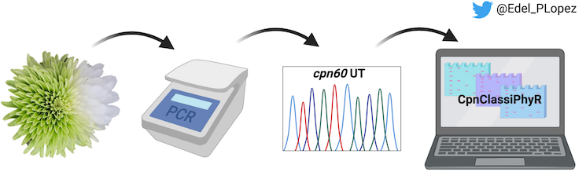

### About

Presenter: Dr. Edel Pèrez-Lòpez - Université Laval\
Date: June 1st 2020\
Host: Lisa Rothmann\
Watch: [Video](https://www.youtube.com/watch?v=T4vA0HJ7rlg) \| [Slides](https://doi.org/10.17605/OSF.IO/QS29R)

### Abstract

Phytoplasmas taxonomy is very complex. Besides genus ('*Candidatus* Phytoplasma'), phytoplasmas are also classified into groups and subgroups based on the RFLP pattern obtained after digesting the F2nR2 sequence (into the 16S rRNA operon) with 17 restriction enzymes. Many other taxonomic markers have been suggested in order to simplify this classification scheme. Since 2014 we identified cpn60 universal target (cpn60UT) as a suitable marker to identify and classify phytoplasmas, developing a friendly classification scheme supported by the 16S classification. We also went further on automating the use of cpn60UT to classify phytoplasmas through the online tool CpnClassiPhyR. Besides, we have been using cpn60UT to develop fast and accurate diagnostic tools to detect phytoplasmas affecting economically important crops. Here I will summarize our findings related with the use of cpn60UT to detect, identify and characterize phytoplasmas.

