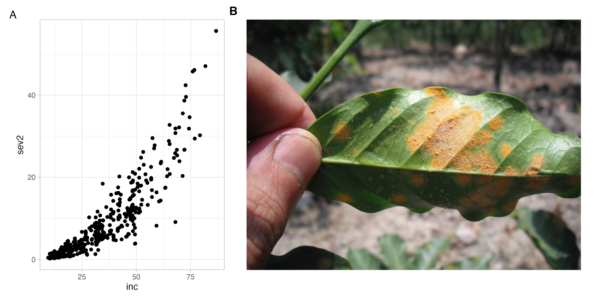

## Today's topic

Hello! this is our inaugural post for the [\#R4PlantPath](https://emdelponte.github.io/OPP-distill/#category:R4PlantPath) blog post category.
Every week or so we will be **sharing one piece of R code** that (we hope!) you will find useful for analyzing or communicating plant pathology research and data more effectively and in a reproducible manner, using R.


I will start with a technique that has been very useful, at least for me, and that many people usually make use of multiple software to prepare: the multi-panel plot figure.
This was the past me, not so many years ago. After learning how to produce plots in R, the next step was to combine them in an image editor software (sounds familiar to you?).

This approach works, of course, but it can be counterproductive every time the plot is updated (or a colleague requests a change) and the whole figure should be re-designed.
It can be even more complicated and laborious if the manual tweaking is extensive.
In brief, it is neither time-effective nor reproducible.

My multi-panel plotting game changed when I discovered the `plot_grid` function of the [{cowplot}](https://wilkelab.org/cowplot/) package (or in short, pkg).
I used it until I discovered another game changer, the [{patchwork}](https://patchwork.data-imaginist.com/index.html) pkg.
Both packages are great options and it is really a matter of preference.
I like the simplicity of the patchwork syntax.

## Who is this post for?

I assume that you are an R (read RStudio and {tidyverse} here) user and are capable of producing a {ggplot2} object.
I will focus mainly on the specifics of how to use the patchwork pkg to produce the most common type of figures and save them in the PNG format.
Please refer to several other good tutorials on the web on how to code using [{tidyverse}](https://www.tidyverse.org/) and create great [visualizations using ggplot](https://r4ds.had.co.nz/data-visualisation.html).

## Would you like some coffee?

Using a plant pathology data set - Yay!
No [iris](https://www.rdocumentation.org/packages/data sets/versions/3.6.2/topics/iris) or [penguins](https://allisonhorst.github.io/palmerpenguins/index.html) allowed here!
I may be biased (as coauthor of the paper) but the data set we are going to use is very rich to explore and demonstrate many ways to produce {ggplot2} figures and different analyses (we will look at these in future posts!).
Plant disease data sets may be more interesting for plant pathologists than for other botanists, biologists and other scientists in general interested in playing with data sets for learning R.

The data set was gathered from a survey for one of the most important diseases globally, coffee leaf rust, caused by *Hemileia vastatrix*.
A large survey was conducted in Ethiopia to map the incidence and severity of the disease during one season.
You can head over to the [paper](https://link.springer.com/article/10.1007/s40858-020-00383-4) for more details if you would like to understand the work at an advance level.

The data set is available online, in a github repo, as a `csv` file.
We will import the coffee leaf rust data into the R environment and store this as a data frame object named `mycoffee`.

```{r message=FALSE, warning=FALSE}
library(tidyverse)
library(readr)
url <-
  "https://raw.githubusercontent.com/emdelponte/paper-coffee-rust-Ethiopia/master/data/survey_clean.csv" #this allows us to import the data from the online github repo
mycoffee <-
  read_csv(url) #and store it as a data frame object in our R environment
```

## Single plots first

In the `mycoffee` data frame, there are two coffee rust-related variables (responses) of interest for our investigation, `inc` and `sev2`, incidence and severity, both are measured as a percentage; and there is a strong **association** between them.

```{r}
theme_set(theme_light()) # for a global ggplot theme

p_cor <- mycoffee %>%
  ggplot(aes(inc, sev2)) +
  geom_point()
p_cor
```

Let's make two other plots, one for `cultivar` (factor variable) and other for `altitude` (numeric variable), relating each with `inc`.
As we did for the first plots, we need to assign each plot to a {ggplot2} object before we can produce the multi-panel figure.

```{r}
p_cult <- mycoffee %>%
  ggplot(aes(cultivar, inc)) +
  geom_boxplot()

p_cult
```

```{r}
p_alt <- mycoffee %>%
  ggplot(aes(altitude, inc)) +
  geom_point()

p_alt
```

## Two-panel plot

Now that we have the two {ggplot2} objects, we can use the {patchwork} pkg to produce a two-plot panel - the easiest way I've seen with the simplest layout, side by side.

```{r}
library(patchwork)
p_cult | p_alt
```

Is that it?
Yes!
Just load the pkg and the `|` character will do the magic when connecting the two {ggplot2} objects.
But there is more, actually much more if you look at the documentation of the pkg
Let's keep exploring a few cool features for our nice coffee rust data set.
Now we switch to the `/` character to see one plot on top of another.

```{r}
p_cult / p_alt
```

## Three-panel plot

What about a three-panel plot... can we also do this?
Yes, just follow the same logic.

```{r}
p_cor /
  (p_cult | p_alt)

# try yourself:
# p_cor | p_cult | p_alt 
```

## Plot annotation

For scientific publishing, we need to refer to each plot by using a tag, usually using letters of the alphabet.
The `plot_annotation` function comes in handy to have the tag_levels defined.

```{r}
p1 <- p_cult | p_alt
p1 + plot_annotation(tag_levels = 'A')

# Try yourself these alternatives:
# p1 + plot_annotation(tag_levels = 'a')
```

Is the default font size too small?
This is no problem, we can customize the text size element of the theme.

```{r}
p1 + plot_annotation(tag_levels = 'A') &
  theme(plot.tag = element_text(size = 20)) 
```

## Plot layout

By default, each plot occupies the same space in the panel.
Sometimes we want them to occupy different spaces, right...
This can be handled using the `plot_layout` function and the width argument.
Let's say we want the scatter plot to be double the width of the boxplot.
The logic is similar when arranging the plots in a single column and two rows, but using the `height` argument.

```{r}
p1 + plot_annotation(tag_levels = "A") +
  plot_layout(widths = c(0.5, 1))
```

```{r}
wrap_elements(grid::textGrob('Text on top side')) + p1
```

## Inset plots

Finally, we want to display a large plot, but the other plot should be an inset of this one.

```{r}
p_cor +
  inset_element(
    p_cult,
    left = 0,
    bottom = 0.4,
    right = 0.4,
    top = 1
  ) +
  theme_light() +
  plot_annotation(tag_levels = "A")
```

## Saving the plots

Saving is the same as with any {ggplot2} object, using the `ggsave` function and setting the `width` and `height`, as well as the `dpi` argument.
Everything working, the PNG file should appear in the working directory.
If the figure is not at the desired size at first, I keep modifying the width and height, until you are happy with your visualization.

```{r, eval=FALSE}
p2 <- p1 +
  plot_annotation(tag_levels = "A")

ggsave(
  filename = "mymultipanel1.png",
  plot = p2,
  width = 8,
  height = 3,
  dpi = 300
)
```

That is it, we hope you find this useful, and of course these are very basic plots that can be heavily customized, but this is beyond my intent with this post, keep an eye our for future posts.
Here is a list of suggested tutorials on patchwork.

-   [The composer of plots - patchwork](https://patchwork.data-imaginist.com/)

-   [Patchwork R package goes nerd viral](https://www.littlemissdata.com/blog/patchwork)

-   [7 tips to combine multiple ggplots using patchwork](https://cmdlinetips.com/2020/01/tips-to-combine-multiple-ggplots-using-patchwork/)

## Post-publication updates

### Plotting raster image (March 11 2021)

For the purpose of plotting raster images, I found that {cowplot} provides a neat solution.
Let's load an image using the `draw_image()` function of {cowplot} (which requires the {magick} pkg to work).
We will download an [image of coffee leaf rust from the internet](https://emerycoffee.files.wordpress.com/2013/04/1024px-hemileia_vastatrix_-_coffee_leaf_rust.jpg) and create the `clr_photo` object.

```{r}
library(cowplot)
clr_photo <- ggdraw() +
  draw_image(
    "https://emerycoffee.files.wordpress.com/2013/04/1024px-hemileia_vastatrix_-_coffee_leaf_rust.jpg"
  ) 
```

OK, now we can use it as any other object in patchwork.

```{r echo=TRUE, eval=FALSE}
(p_cor | clr_photo) +
  plot_layout(widths = c(0.5, 1))+
  plot_annotation(tag_levels = "A")

ggsave("mymultipanel2.png", width = 10, height = 5)
```

Here is the image as saved.


