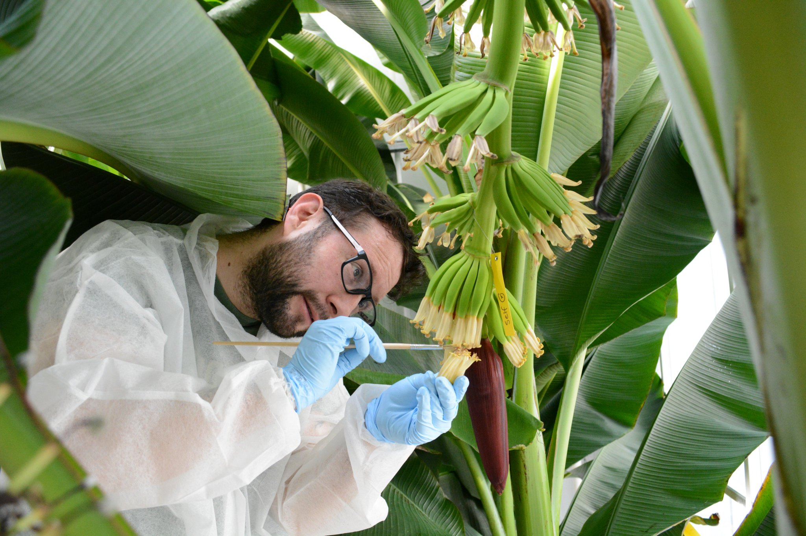

### As some may know you are a Colombian researcher in Wageningen (NL) at KeyGene, recently promoted to Principal Researcher. Currently, leading a banana breeding program, focusing on Panama Disease, i.e. Fusarium Wilt of Banana. How did this become a passion for you?

I've been passionate about plant sciences since I can remember, I really enjoyed my former work, and am excited about my current opportunity as well.
Before working with bananas and *Fusarium*, I worked with coffee and coffee-leaf rust.
I was passionate, creative and innovative...
but of course, showing that passion publicly was difficult 15 years ago without social media.
Nowadays, we have many platforms to explore and show our passion for our work and careers.
My motto is: 'enjoy life' and I try my best to do so.
I work hard, and I'm can be very serious, but I try to find the most efficient and a fun way to do my work. 
Fusarium wilt, the topic of my current research, is very a serious disease and touches all levels of society, as bananas are not only a snack for some but a staple food in many regions, including my own.
I spend a lot of time and effort to become a better scientist and contribute to solving this problem.

------------------------------------------------------------------------

### **When did you realize you had a love for drawing and in particular cartoons of plant diseases/pathogens?**

Along with my love for plant sciences, I also have a love for art - especially drawing caricatures.
I have been drawing these, since I was a kid, I particularly like caricatures.
I used to draw famous artists and writers and make little biographies of them using my cartoons.
Then as I grew older, I started to draw my classmates and teachers which put me into trouble many times as caricatures are a difficult thing...
you know?
Not everyone likes to be a caricature.
When I started to work as a researcher in the coffee breeding centre a colleague of mine really enjoyed my caricatures and she asked if I would draw a caricature for an event of entomophagy (this is the technical term for insect eating...).
I drew a grasshopper with chopsticks eating a chef, a few days later she asked me if I could draw another, of a red spider-mite with an umbrella to explain the effect of the sun on red spider-mite (a pest on coffee), and again it was a hit.
So...
this lead to me getting more and more requests.

I notice that my art could be useful not only to make fun of people but also to teach and educate, my peers and the public.
Since then, I started to draw a combination of fun cartoons but also let's call them...
academic cartoons.
I used them when I was lecturer at the University on my presentations, and the students really liked my style and even printed my cartoons for themselves.
Then, for almost 5 years, I had a dark period and I stopped my art, even my vlogs.
When I came to the Netherlands one day a student spotted me drawing, and again I was encouraged by her to continue with my passion for drawing.
Since 2017, I haven't stop, nowadays, 80% of my cartoons are banana related - an that is why I call them #bananatoons.

------------------------------------------------------------------------

### **It seems your take on science communication, is multifaceted, using video (aka vlogs), drawn and text content to draw the readers attention. Why do you think #scicomm is so important and who is your target audience, currently?**

This is a difficult question as I consider myself as a digital content creator, who also participates in SciComm, and indeed, SciComm is just a small portion of what I do as a digital creator.
I like creating and if I dedicate just to SciComm I feel this would limit my creativity, and that is why I combine fun random content with my SciComm contributions.
I recently started to pay more attention to Twitter but for several years I have been "teaching" among other things on [Instagram](https://www.instagram.com/ferchuckytoons/?hl=en), where I have my biggest audience.
My target audience is, without a doubt, people without a scientific background.
I try to make science easier for layman people.
I use my cartoons, my videos, etc., to communicate or to simply teach new stuff, even cooking with bananas...
My number one rule is: to be fun and visual.
That is why I enjoy videos, drawings and photography.
I miminse the amount of text, because most people don't even read the posts they just react to images, and I'm okay with that because I also don't have too much time to read.

### **What advice do you have for early-career researchers or graduates, when it comes to creative walls or blocks? How do you overcome these and keep passionate about your work, both research and comics?**

To explore, find their style and to be inspired by others.
Everyone has something to teach you, be open to this. 
Don't limit yourself by surrounding yourself only with academics, particularly those with similar passions to yours.
I prefer to be mixed into a community of academics,  artists, foodies, influencers, etc., people from different backgrounds, they help me see the world differently and create from their persective and for their enjoyment.
People outside of academia already know how to reach thousands of people and "we" as academics can use their strategies to reach more people with our science. 
To keep inspired, from my personal experience, I would say: *Try to enjoy your work, find a way to make it fun*, even though I know sometimes is difficult. 

------------------------------------------------------------------------
