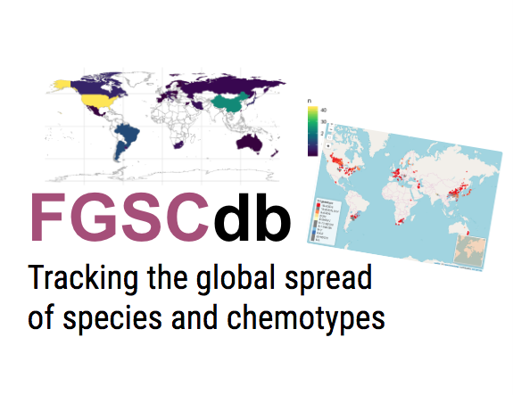

## Background

Members of the *Fusarium graminearum* species complex (FGSC), an ascomycete fungus, rank among the most dangerous plant pathogens worldwide. These mycotoxigenic fungi affect mainly small grain crops such as wheat and barley, but also maize, rice and other important cereal crops. During the first decade of 2000, employing multilocus sequencing of global collections of strains that were morphologically defined as a single panmictic species previously known as "*Fusarium graminearum*", 16 species have been described [@odonnell2000; @odonnell2004; @starkey2007; @odonnell2008; @yli-mattila2009; @sarver2011]. Since then, researchers from all over the world have been surveying cereal crops and identifying these newly discovered phylogenetic species and associated toxin profile using molecular tools [@backhouse2014; @vanderlee2015; @aoki2012]. An European database of chemotypes has been developed [@pasquali2016].

## What is the database for?

[FGSCdb](https://fgsc.netlify.app/) is an open database of characterized FGSC strains whose data have been gathered directly from researchers or extracted from peer-reviewed articles whenever the geographic, host of origin, year, and phylogenetic species (and associated trichothecene chemotype/genotype whenever available) information are available in the main text or supplemental material of the publication. The project was developed as supplemental material for a systematic r) view article to be submitted soon for publication (Del [Ponte](https://cran.r-project.org/web/packages/distill/index.html) et al. unpublished).

## How is it developed?

The database is organized in a Google Sheet, an online spreadsheet that facilitates shared work and collaboration. Scripts to gather the data and prepare grid, plot and map visualizations were developed using several R packages including [crosstalk](https://cran.r-project.org/web/packages/crosstalk/index.html) for adding interactivity in the grid and map view. The main packages used were [leaflet](https://rstudio.github.io/leaflet/) for maps, [datatable](https://rstudio.github.io/DT/) for grid view and [plotly](https://cran.r-project.org/web/packages/plotly/index.html) for dynamic plotting. The website is constructed using the [distill](https://cran.r-project.org/web/packages/distill/index.html) R package. The raw data can be downloaded in PDF or excel format.

## What's next?

We would like to extend the utility of this project by allowing other researches to contribute data to populate the global map. Get in touch ([delponte\@ufv.br](mailto:delponte@ufv.br){.email}) to receive instructions on how to submit your data.

{width="300"}

**Project website**: [fgsc.netlify.app](http://fgsc.netlify.app)\
**Data source**: [github.com/emdelponte/FGSC](https://github.com/emdelponte/FGSC)\
**Author and maintainer**: Emerson M. Del Ponte\
**Maintainer**: Gláucia M. Moreira\
**Current collaborators** (raw data): Camila P. Nicolli, Todd J. Ward, Cees Waalwijk, Theo van der Lee, Kerry O'Donnell, Sofia N. Chulze, Sebastian A. Steinglein, Dinorah Pan, Silvana Vero, Hao Zhang, Dauri J. Tessmann, Lisa J. Vaillancourt, Antonio Moretti, Antonio Logrieco

------------------------------------------------------------------------
