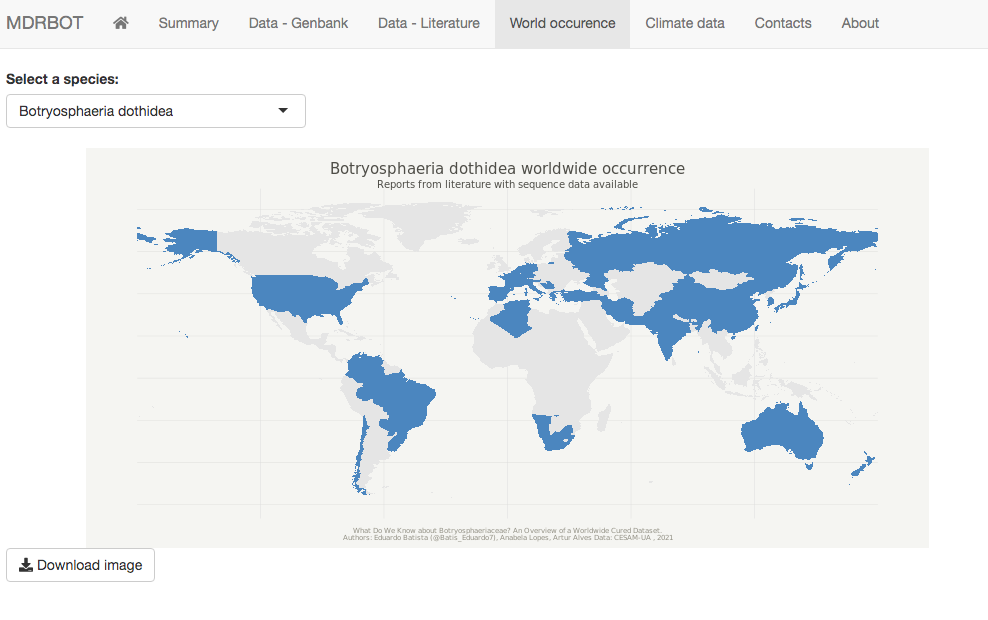

## Database summary

This dataset is freely available through an interactive and online application. The current release (version 1.0) contains 14,405 cured isolates and 2989 literature references of 12,121 different host--fungus interactions with 1692 different plant species from 149 countries.

## Background

Botryosphaeriaceae-related diseases occur worldwide in a wide variety of plant hosts. The number of studies targeting the distribution, diversity, ecology, and pathogenicity of Botryosphaeriaceae species are consistently increasing. However, with the lack of consistency in species delimitation, the name of hosts, and the locations of studies, it is almost impossible to quantify the presence of these species worldwide, or the number of different host--fungus interactions that occur. In a recently published paper [@batista2021], we collected and organized Botryosphaeriaceae occurrences in a single cured dataset, allowing us to obtain for the first time a complete perspective on species' global diversity, dispersion, host association, ecological niches, pathogenicity, communication efficiency of new occurrences, and new host--fungus associations.

## What is the database for?

The MDRBOT database was built using R 3.6.0 with a web shiny interface. The website includes a search engine to find the cured Botryosphaeriaceae isolates from the Nucleotide---NCBI database and for the host--fungus interaction dataset, where the user can perform multiple field search and download the output in an excel format file (.xlsx).

A worldwide map generator tool for species occurrence is available, where the user can select an input species and generate a world occurrence map. A climate data analysis is included, where the user can select an input species and observe isolates with valid geographical information and evaluate the main climate variables associated with these records (minimum, average and maximum annual temperature, and minimum, average, and maximum annual precipitation). The option to download the output maps as a portable network graphics file (.png) for both occurrence and climate data analyses is also available.

## How is it developed?

### Data Extraction from Nucleotide---NCBI Database

An initial query was performed on 12-05-2020 in the Nucleotide---NCBI database using the search term "Botryosphaeriaceae [Organism]" with the R package [rentrez](https://cran.r-project.org/web/packages/rentrez/index.html). In total, 49,955 sequences were retrieved. Information such as organism, strain/culture collection, host, geographical coordinates, country, and the title of publication were also extracted.

Screening was performed by removing duplicates and records without a strain or culture collection number. For each isolate, when available, sequences from the internal transcribed spacer region of rRNA region (ITS), translation elongation factor 1-alpha (tef1-α), beta-tubulin (tub2), second largest subunit of RNA polymerase II (rpb2), and two alternate forms of the MAT locus (MAT1-1-1 and MAT1-2-1) were selected.

All the sequences were grouped by the strain or culture collection number and all features were manually standardized. Special characters were removed from the strain/culture collection feature and organized by the main culture collections. Geographical coordinates were transformed to the decimal form of the WGS84 geodetic datum and countries' names were organized according to the International Organization for Standardization (ISO) reference system. Host names were cured according to the Catalogue of Life: 2019 Annual Checklist from the CoL+ project .

Climate variables were extracted from the Climatologies at a high resolution for the Earth's land surface areas project (CHELSA) only for records with geographical coordinates. The organism name was verified and updated according to recent literature and a sequence quality screening was performed by running a pairwise blast analysis between the ITS of each isolate against the sequence of the type of each genus. Isolates with a similarity lower than 94.3% were removed.

### Data Extraction from U.S. National Fungus Collections

A query was performed by genus (Alanphillipsia, Barriopsis, Botryobambusa, Botryosphaeria, Cophinforma, Diplodia, Dothiorella, Endomelanconiopsis, Eutiarosporella, Lasiodiplodia, Macrophomina, Marasasiomyces, Mucoharknessia, Neodeightonia, Neofusicoccum, Neoscytalidium, Oblongocollomyces, Phaeobotryon, Sardiniella, Sphaeropsis) on 12-05-2020. Data regarding fungus--host interactions were extracted and organized by country, year, and citation. In total, 22,698 host--fungus interactions were extracted. Similarly, to the previous screening, duplicates were removed, and all features were standardized by the same rules .

### MDRBOT Database and Shiny Interface

A literature review was performed, and both datasets were analyzed to fill missing information. Several extra organization-level features were built to allow different filter functions. A shiny interface was created to allow easy access to both datasets.

## What is next?

To help future editions of this database is important that authors upload all isolates information in genbank consistently. For countries names please use ISO 3166 standards and for the host please confirm if your species name is accepted by the CoL+ Project. If you have geographical coordinates, please add it to your genbank submission. For records already present in our database you can upload your information by email to us ([Eduardobatista\@ua.pt](mailto:Eduardobatista@ua.pt){.email}).

## Project details

**Project website**: <https://mdr-bot-cesam-ua.shinyapps.io/bot_database/> \
**Authors**: Eduardo Batista, Anabela Lopes, Artur Alves \
**Maintainer**: Eduardo Batista, Anabela Lopes, Artur Alves \
**Current collaborators** (raw data): Eduardo Batista, Anabela Lopes, Artur Alves
