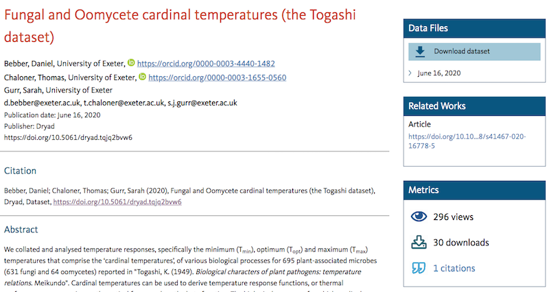

## Background

Cardinal temperatures provide a basic definition of the temperature response functions, or thermal performance curves (TPCs), of physiological processes. The cardinal temperatures are the minimum temperature (Tmin) below which a process will not occur, the optimal temperature (Topt) at which the process occurs most rapidly, and the maximum temperature (Tmax) above which the process ceases. A large collection of experimentally-determined cardinal temperatures for hundreds of plant pathogens was published by Togashi (1949) and [has now been digitized](https://doi.org/10.5061/dryad.tqjq2bvw6).

## What is the database for?

Cardinal temperatures can be useful for epidemiological models of plant disease [@bebber2019]. Cardinal temperatures can help to understand the ecological niche of plant pathogens [@chaloner2020] and how temperature physiology evolves under climate change, for example.

## What's next?

The data published in Togashi (1949) are old, and many experimental studies on plant pathogen temperature responses have been published since (examples in [@magarey2005]). New estimates of cardinal temperatures can be estimated from published thermal performance curves [@bebber2019]. Future work will involve collating TPCs and estimating cardinal temperatures from the literature.

## Further information 

Data source: [@bebber2020]

Togashi, K. (1949). Biological characters of plant pathogens: Temperature relations. Meibundo.

Contact: Dan Bebber
