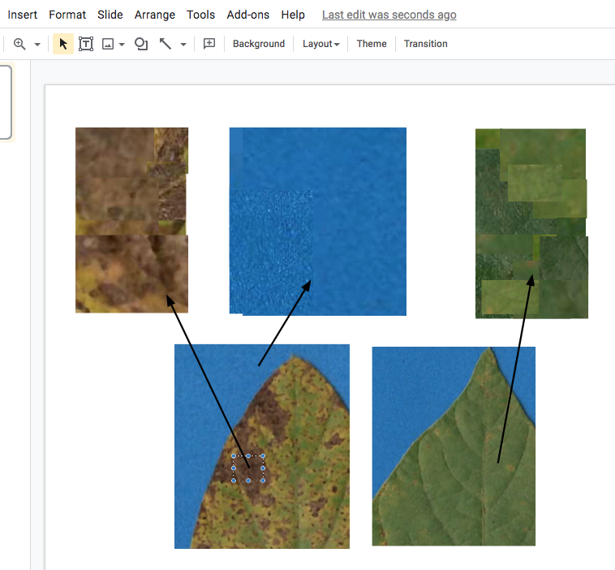
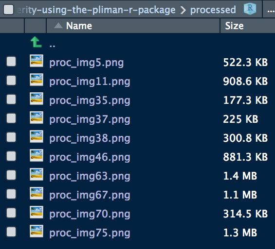

## 2022/02/06 Note

This post has been modified from its original content to work with the latest version of pliman at the current time, v1.1.0.
Some minor changes in the flow of the code were necessitated by changes in the output of functions in pliman and changes in the function names.
The results should remain the same.

## Introduction

Two weeks ago I came across [pliman](https://tiagoolivoto.github.io/pliman/), a new R package developed by [Tiago Olivoto](https://github.com/TiagoOlivoto) that provides a suite of functions for conducting several analyses on images of plants. For obvious reasons, I was greatly interested in testing a function that allows measuring plant disease severity - or the percentage leaf area affected.

More than two dozen software, most of them proprietary, have been used for measuring percentage severity in phytopathometry research [@Del2017]. As far as I know, there is no specialized R package or one with functions built particularly for plant disease severity measurement.

The availability of these image analysis tools is of great importance mainly for research purposes or situations when the most accurate severity is necessary [@bock2020a]. Examples include the development of standard area diagrams (set of images of leaves with known severity) as well as their validation when an "actual" severity measurement is required. These images are usually obtained under standardized conditions (light and background) and analyzed individually. However, a batch processing can automate and greatly speed up the process - which is of course beneficial in any research field.

In this post I will demonstrate how to measure severity using the `sympmatic_area()` function of `pliman` to measure severity in 10 leaves (batch processing) infected with soybean rust. I will further compare the measures with ones determined using QUANT software as used in a previous work [@franceschi2020]

## What is healthy and diseased?

The most critical step is the initial step - this avoids garbage in, garbage out, when the user needs to correctly define the color palettes, which in `pliman` are separate images representing each of three classes named background (b), symptomatic (s) and healthy (h).

These reference image palettes can be made simply by manually sampling small areas of the image and producing a composite image. Of course, the results may vary significantly depending on how these areas are chosen, and are subjective in nature due to the researchers experience. The observation of the processed masks becomes important to create image palettes that are most representative of the respective class.

Here, I cut and pasted several sections of images representative of each class from a few leaves into a Google slide. Once the image palette was ready, I exported each one as a separate image PNG file (JPG also works). These were named: sbr_b.png, sbr_h.png and sbr_s.png.



Now that we have the image palettes, we can start by importing the image palettes into the environment for further analysis. Let's create an image object for each palette named h (healthy), s (symptoms) and b (background).

```{r message=FALSE, warning=FALSE}
# install.package("pliman")
# note that pliman requires R version 4 and EBImage pkg
# install.packages("BiocManager")
# BiocManager::install("EBImage")

library(pliman)
h <- image_import("sbr_h.png")
s <- image_import("sbr_s.png")
b <- image_import("sbr_b.png")
```

We can visualize the imported images using the `image_combine()` function.

```{r}
image_combine(h, s, b, ncol = 3)
```

## Measuring severity

### Single image

To determine severity in a single image (img46.png), the image file needs to be loaded and assigned to an object using the same `image_import()` function used to load the palettes for each of the predefined classes. We can then visualize the image, again using `image_combine()`.

```{r}
img <- image_import("originals/img46.png")
image_combine(img)
```

Now the fun begins with the `measure_disease()` function to determine severity. Four arguments are needed, the one representing the target image and each of the three images of the color palettes. As the author of the package says "pliman will take care of all details!"

```{r}
measure_disease(
  img = img,
  img_healthy = h,
  img_symptoms = s,
  img_background = b,
  show_image = TRUE
)
```

### Lots of images

That was fun, but usually we don't have a single image to process but several. It would take a longer time to process each one using the above procedure, thus becoming tedious.

To automate the process, pliman offers a batch processing approach. For such, instead of using `img` argument, one can use `img_pattern` and define the prefix of names of the images. In addition, we also need to define the folder where the original files are located.

If the users wants to save the processed masks, the `save_image` argument needs to be set to TRUE and the directory where the images will be saved also should be informed. Check below how to process 10 images of soybean rust symptoms. The outcome is a `list` object with the measures of the percent healthy and percent symptomatic area for each leaf in the `severity` object.

```{r}
pliman <- measure_disease(
  pattern = "img",
  dir_original = "originals" ,
  dir_processed = "processed",
  save_image = TRUE,
  img_healthy = h,
  img_symptoms = s,
  img_background = b,
  show_image = FALSE
)
severity <- pliman$severity
severity
```

With the argument `save_image` set to TRUE, the images are all saved in the folder with the standard prefix "proc".



## How good are these measures?

These 10 images were previously processed in QUANT software for determining severity. Let's create a tibble for the image code and respective "actual" severity - assuming QUANT's measures as reference.

```{r message=FALSE, warning=FALSE}
library(tidyverse)
quant <- tribble(
  ~img, ~actual,
   "img5",     75,
  "img11",     24,
  "img35",     52,
  "img37",     38,
  "img38",     17,
  "img46",      7,
  "img63",    2.5,
  "img67",   0.25,
  "img70",     67,
  "img75",     10
  )
```

We can now combine the two dataframes and produce a scatter plot relating the two measures.

```{r}
dat <- left_join(severity, quant)

dat %>%
  ggplot(aes(actual, symptomatic)) +
  geom_point() +
  ylim(0, 100) +
  xlim(0, 100) +
  geom_abline(slope = 1, intercept = 0) +
  theme_bw() +
  labs(x = "Quant",
       y = "pliman")
```

The concordance correlation coefficient is a test for agreement between two observers or two methods. It is an indication of how accurate the pliman measures are compared with a standard. The coefficient is greater than 0.97 (1.0 is perfect concordance), suggesting an excellent agreement!

```{r}
library(epiR)
ccc <- epi.ccc(dat$actual, dat$symptomatic)
ccc$rho.c
```

## Conclusion

The community of R users may enjoy using [pliman](https://tiagoolivoto.github.io/pliman/) as an alternative to proprietary software or other point-and-click open source solutions such as imageJ. The simplicity of the batch processing approach can greatly improve the speed of the assessment and the user can set arguments to run R in parallel for enhanced computational speed.

The most critical step, as I mentioned, is the definition of the reference color palettes. A few preliminary runs may be needed for a few leaves to check whether the segmentation is being performed correctly, based on visual judgement. This is no different than any other color-threshold based methods when the choices made by the user affect the final result and contribute to variation among assessors [@Bock2009]. The cons are the same encountered in the direct competitors, which is the necessity to have images obtained at uniform and controlled conditions, especially a contrasting background.

## Colophon

This post was constructed using R Version ```r paste(R.Version()[c("major", "minor")], collapse = ".")``` [@RCore2021] pliman version `r packageVersion("pliman")`.
