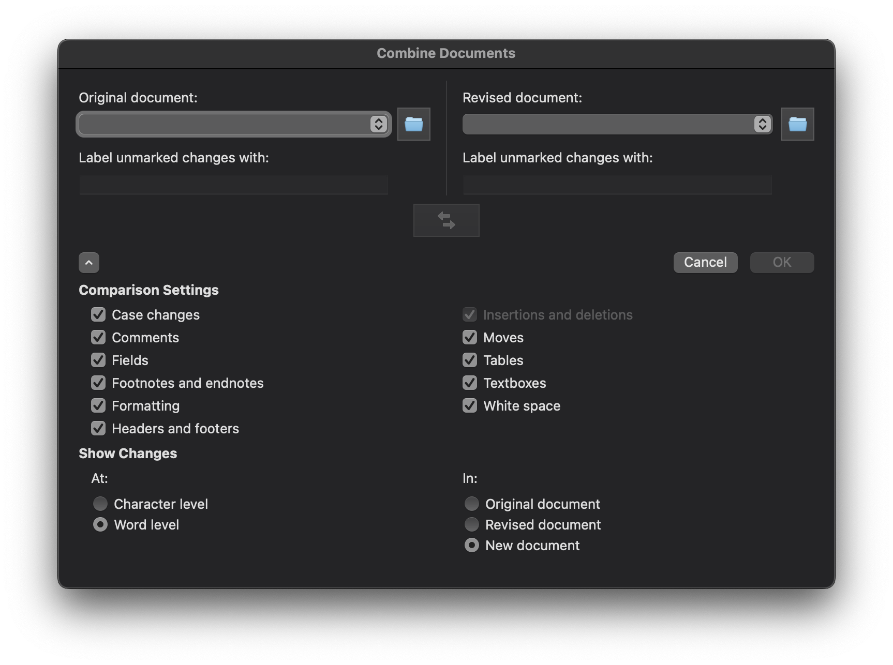

```{r setup, include=FALSE}
knitr::opts_chunk$set(echo = FALSE)
```

While most plant pathologists are likely to write their manuscripts collaboratively in Microsoft Word, what if you instead prefer to harness RMarkdown or Quarto and Git for your collaborative writing?
Often times journal submissions require the response to have a Word Document with changes tracked to be resubmitted for the editor and reviewers to evaluate and track the changes that were made in the manuscript.
The combination of these two approaches may make it seem that they aren't compatible.
However, with the right combination of both tools, it's possible to use the best of both of these tools and meet the needs of the authors and the journals.

The first step is to use Git effectively.
When you submit your manuscript, create a release that corresponds with the version of the manuscript that you have submitted.
This way you have a good record of what changes were made in your Rmd/Qmd file up to that point and know that you can accurately recreate the Word document as submitted for review.
This will be used as your basis for tracking the changes that were made in response to the review.

Second, when you receive the response from the review process, create a new branch to work from leaving the original branch untouched so that you can still reknit your original Word document as submitted for the initial review.

Third, make your edits with your co-authors to the Rmd/Qmd file tracking the changes in Git using the new branch for the response to the review.

Fourth, once you are ready to resubmit your manuscript, knit the new version and save the Word document locally.

Fifth, if you have the original Word document as submitted you can use this or you can check out your original Git branch and reknit the Word document as submitted.
If necessary, save this file locally as well.

Sixth, while using Word, go to "Tools" \> "Combine Documents".
Using this tool, select your original document as "Original document:" and your newly edited document as "Revised document:".
I suggest using the default approach to combine them together in a new document.



Seventh, check that the changes have been accurately tracked and add any necessary comments to respond to the reviewers.

Eighth, save the new document and use this for your response to the review with the changes tracked.

Lastly, once you have prepared your response, merge the new branch back into the main and create another release to correspond with the response to review submission.
This way you have releases that correspond to the entire process along the way and you can easily track your changes with greater detail in Git than what the Word document offers, while still offering the necessary information for the editor and reviewers to see the changes that were made.
