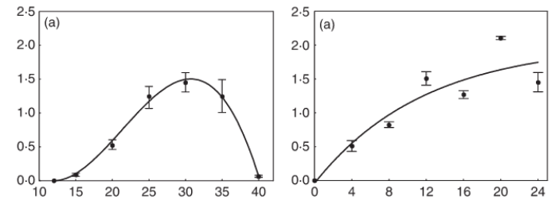

## Introduction

Studies on the relationship between environmental variables and disease in the field are fundamental to develop **empirical** (statistical) disease prediction models [@delponte2006]. On the other hand, relationships studied in the controlled environment (laboratory or greenhouse) provide a basis to develop **fundamental** models or sub-models that describe specific processes such as sporulation, dispersal, infection and incubation [@magarey2005; @krause1975]. These submodels can be further incorporated into mechanistic models that mimic advance of the disease cycle [@rossi2008], or directly into predictive systems where the infection submodel is the most critical information for disease occurrence [@machardy1989]. The infection models are based on regression equations of various forms [@magarey2005; @biggs1988; @dewolf2007; @dallapria2006].

Here, we will fit a beta generalized model [@hau1990] to data on the response to temperature and an asymptotic regression model to data on the response to wetness duration. The integration of the two models can be used to develop contour or surface-response plots.

## Data source

We will use a subset of the data obtained from a study conducted under controlled conditions that aimed to assess the influence of temperature and leaf wetness duration on infection and subsequent symptom development of citrus canker in sweet orange [@dallapria2006].

The data used here is only for severity on the cultivar Hamlin. The mean value was extracted from Figures 1 and 2 (see below). The left plot is for the response to temperature and the right plot is for the response wetness duration. The response is severity of infection.



The data was extracted using the R package digitize as shown [here on this tweet](https://twitter.com/edelponte/status/1580320409794539520?s=20&t=KqjJPmwzFVKm8Gu7Ss-P6A).

## Modelling the effect of temperature

Let's enter the data manually. t is the temperature and y is the severity on leaves.

```{r}
temp <- tibble::tribble(
  ~t, ~y,
12.0, 0.00,
15.0, 0.1,
20.0, 0.5,
25.0, 1.2,
30.0, 1.5,
35.0, 1.2,
40.0, 0.1
)

```

Fit the beta generalized model [@hau1990]. The model can be written as:

$$
y = a*((t - b )^d)*((c - t)^e)
$$

where b and d represent minimum and maximum temperatures, respectively, for the development of the disease, a, c and e are parameters to be estimated, t is the temperature and y is disease severity. We need the *minpack.lm* library to avoid parameterization issues.

```{r}
library(minpack.lm)
fit_temp <- nlsLM(y ~ a*((t - b )^d)*((c - t)^e),
             start = list(a = 0,
                          b = 10, 
                          c = 40, 
                          d = 1.5, 
                          e = 1),
             algorithm = "port",
             data = temp)
summary(fit_temp)
library(modelr)
modelr::rsquare(fit_temp, temp)
```

Store the model parameters in objects.

```{r}
fit_temp$m$getAllPars()
a <- fit_temp$m$getAllPars()[1]
b <- fit_temp$m$getAllPars()[2]
c <- fit_temp$m$getAllPars()[3]
d <- fit_temp$m$getAllPars()[4]
e <- fit_temp$m$getAllPars()[5]
```

Create a data frame for predictions at each temperature unit from 10 to 45 degree Celsius.

```{r}
t <- seq(10,45, 0.1)
y <- a*((t - b )^d)*((c - t)^e)
dat <- data.frame(t, y)
```

Plot the observed and predicted data using **ggplot2** package.

```{r warning=FALSE}
library(tidyverse)
dat |> 
  ggplot(aes(t, y))+
  geom_line()+
  geom_point(data = temp, aes(t, y))+
  theme_classic(base_size = 16)+
  labs(x = "Temperature", y = "Severity" )

```

## Modelling the effect of wetness duration

Again, we enter the data manually. The x is wetness duration in hours and y is severity.

```{r}
wet <- tibble::tribble(
  ~x, ~y,
0 ,  0,
4 ,  0.50,
8 ,  0.81,
12,  1.50,
16,  1.26,
20,  2.10,
24,  1.45
)

```

Now we fit a three-parameter asymptotic regression model. These models describe a limited growth, where y approaches an horizontal asymptote as x tends to infinity. This equation is also known as Monomolecular Growth, Mitscherlich law or von Bertalanffy law. See this [tutorial](https://www.statforbiology.com/nonlinearregression/usefulequations) for comprehensive information about fitting several non-linear regression models in R.

The model can be written as

$$
y = c1 + (d1-c1)*(1-exp(-x/e1)) 
$$

Where c is the lower limit (at x = 0), the parameter d is the upper limit and the parameter and e (greater than 0) is determining the steepness of the increase as x.

We will solve the model again using the `nlsLM` function. We should provide initial values for the three parameters.

```{r}
library(minpack.lm)
fit_wet <- nlsLM(y ~ c1 + (d1-c1)*(1-exp(-x/e1)), 
              start = list(c1 = 0.5,
                           d1 = 3,
                           e1 = 1),
                           data = wet)

summary(fit_wet)
library(modelr)
modelr::rsquare(fit_wet, wet)
```

Store the value of the parameters in the respective object.

```{r}
HW <- seq(0,24, 0.1)
c1 <-  fit_wet$m$getAllPars()[1]
d1 <- fit_wet$m$getAllPars()[2]
e1 <- fit_wet$m$getAllPars()[3]
y <-  (c1 + (d1-c1)*(1-exp(-HW/e1)))
dat2 <- data.frame(HW, y)
```

Now we can plot the results and the original data.

```{r, warning=FALSE}
library(tidyverse)
dat2 |> 
  ggplot(aes(HW, y))+
  geom_line()+
  geom_point(data = wet, aes(x, y))+
  theme_classic(base_size = 16)+
  labs(x = "Wetness duration", y = "Severity" )

```

## Integrate the models

Integrate the two equations to create a contour plot. We need a data frame for the interaction between t and hours of wetness. Then, we obtain the disease value for each combination of t and HW.

```{r}
t <- rep(1:40,40)
HW <- rep(1:40, each = 40)
dis <- (a*(t - b )^d)*((c - t)^e) * (c1 + (d1-c1)*(1-exp(-HW/e1)))
validation <- data.frame(t, HW, dis)
```

Now the countour plot can be visualized using *ggplot2* and *geomtextpath* packages.

```{r fig.height=5, fig.width=8}
library(ggplot2)
library(geomtextpath)
ggplot(validation, aes(t, HW, z = dis)) + 
  geom_contour_filled(bins = 8, alpha = 0.7) + 
  geom_textcontour(bins = 8, size = 2.5, padding = unit(0.05, "in")) + 
  theme_minimal() +
  theme(legend.position = "right")+
  ylim(0, 40)+
  labs(y = "Wetness duration (hours)", fill = "Severity", x = "Temperature (Celcius)")
```

That's it. Fell free to [reach](delponte@ufv.br) me in case of questions!
